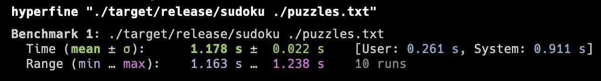

# sudoku-cli-rs

cli sudoku solver to experiment with clap & other Rusty stuff

## results

When running the release build against the sample puzzle file, which contains
49,158 puzzles, it takes a little under 1.2 seconds to read, solve, and write
the solution to every puzzle.

Credit to the [sudoku crate](https://docs.rs/sudoku/0.7.0/sudoku/) for that speed.
I'm just wrapping it in a clap CLI to mess around with the crate.

## puzzle file format

One puzzle per line. 81 characters per line:

- `.` for empty cells
- `1`-`9` for filled cells

## sample puzzle file's source

Gordon Royle's list of 49158 puzzles, available via
[Google Drive](https://drive.google.com/file/d/1StS_Sm_Eh9ZJTapOsrRJccM6UP6PmQ3B/view?usp=sharing).
